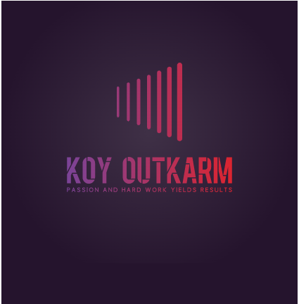

<a name="readme-top"></a>

<div align="center">
  
  <br/>

  <h3><b>Koy Outkarm</b></h3>
</div>

# 📗 Table of Contents

- [📖 About the Project](#about-project)
  - [🛠 Built With](#built-with)
  - [🚀 Live Demo](#live-demo)
- [💻 Getting Started](#getting-started)
  - [Setup](#setup)
  - [Prerequisites](#prerequisites)
  - [Install](#install)
  - [Usage](#usage)
  - [Run tests](#run-tests)
  - [Deployment](#deployment)
- [👥 Authors](#authors)
- [🔭 Future Features](#future-features)
- [🤝 Contributing](#contributing)
- [⭐️ Show your support](#support)
- [🙏 Acknowledgements](#acknowledgements)
- [❓ FAQ (OPTIONAL)](#faq)
- [📝 License](#license)

<!-- PROJECT DESCRIPTION -->

# 📖 Hello Rails React <a name="about-project"></a>

Hello Rails React is a sample Rails application that integrates React for frontend development. It demonstrates how to set up a Rails app with React, use react-router for routing, connect to a Rails API endpoint, and display data in a React component.

## 🛠 Built With <a name="built-with"></a>

### Tech Stack <a name="tech-stack"></a>

<details>
  <summary>Client</summary>
  <ul>
    <li><a href="https://reactjs.org/">React.js</a></li>
  </ul>
</details>

<details>
  <summary>Server</summary>
  <ul>
    <li><a href="https://rubyonrails.org/">Ruby on Rails</a></li>
  </ul>
</details>

<details>
<summary>Database</summary>
  <ul>
    <li><a href="https://www.postgresql.org/">PostgreSQL</a></li>
  </ul>
</details>

### Key Features <a name="key-features"></a>

- **Integration of React with Ruby on Rails**
- **React Router for frontend routing**
- **API endpoint for random greetings**

<p align="right">(<a href="#readme-top">back to top</a>)</p>

<!-- LIVE DEMO -->

## 🚀 Live Demo <a name="live-demo"></a>

- [Live Demo Link](https://your-app-demo-url.com)

<p align="right">(<a href="#readme-top">back to top</a>)</p>

<!-- GETTING STARTED -->

## 💻 Getting Started <a name="getting-started"></a>

To get a local copy up and running, follow these steps.

### Prerequisites

In order to run this project, you need to have the following installed:

- Ruby (version 3.2.1)
- Node.js (version 18.16.0)
- Yarn (optional but recommended)
- PostgreSQL

### Setup

Clone this repository to your desired folder:

```sh
git clone <repository_url>
cd hello-rails-react
```

### Install

Install the required Ruby gems:

```sh
bundle install
```

Install the required Node.js packages:

```sh
yarn install
```

### Usage

Start the

Rails server:

```sh
rails server
```

Open your browser and visit `http://localhost:3000` to see the application running.

### Run tests

To run the tests, execute the following command:

```sh
bundle exec rspec
```

### Deployment

This project can be deployed using your preferred hosting platform or service. Follow the deployment instructions provided by the platform of your choice.

<p align="right">(<a href="#readme-top">back to top</a>)</p>

<!-- AUTHORS -->

## 👥 Authors <a name="authors"></a>

👤 **John Kpordje**

- GitHub: [@Outkarm](https://github.com/Outkarm)
- Twitter: [@outkarm](https://twitter.com/outkarm)
- LinkedIn: [John Kpordje](https://www.linkedin.com/in/john-kpordje-866749241/)

<p align="right">(<a href="#readme-top">back to top</a>)</p>

<!-- FUTURE FEATURES -->

## 🔭 Future Features <a name="future-features"></a>

- [ ] **Feature 1: Add user authentication**
- [ ] **Feature 2: Implement a user profile page**
- [ ] **Feature 3: Allow users to create and manage their own greetings**

<p align="right">(<a href="#readme-top">back to top</a>)</p>

<!-- CONTRIBUTING -->

## 🤝 Contributing <a name="contributing"></a>

Contributions, issues, and feature requests are welcome!
Feel free to check the [issues page](../../issues/) for any open issues or to create a new one.

<p align="right">(<a href="#readme-top">back to top</a>)</p>

<!-- SUPPORT -->

## ⭐️ Show your support <a name="support"></a>

If you find this project helpful or you like it, please consider starring it and showing your support by sharing it with others.

<p align="right">(<a href="#readme-top">back to top</a>)</p>

<!-- ACKNOWLEDGEMENTS -->

## 🙏 Acknowledgements <a name="acknowledgements"></a>

Special thanks to the Microverse community and the open-source contributors for their valuable contributions.

<p align="right">(<a href="#readme-top">back to top</a>)</p>

<!-- LICENSE -->

## 📝 License <a name="license"></a>

This project is [MIT](./LICENSE) licensed.

<p align="right">(<a href="#readme-top">back to top</a>)</p>
